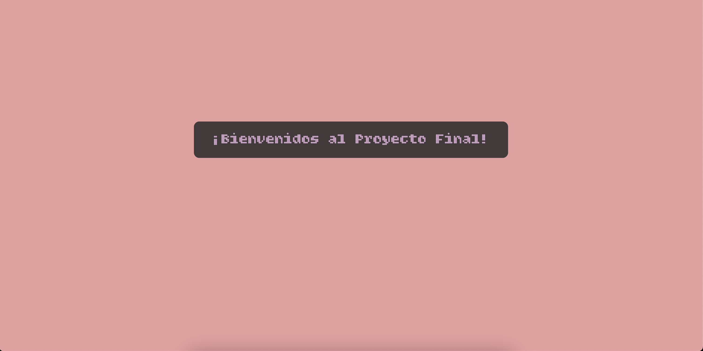
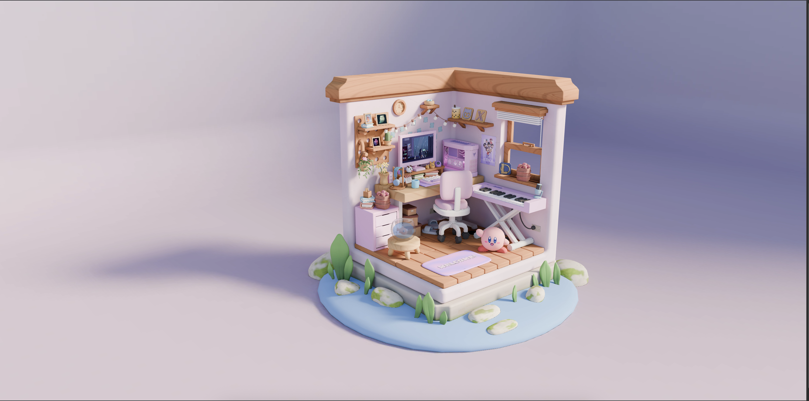
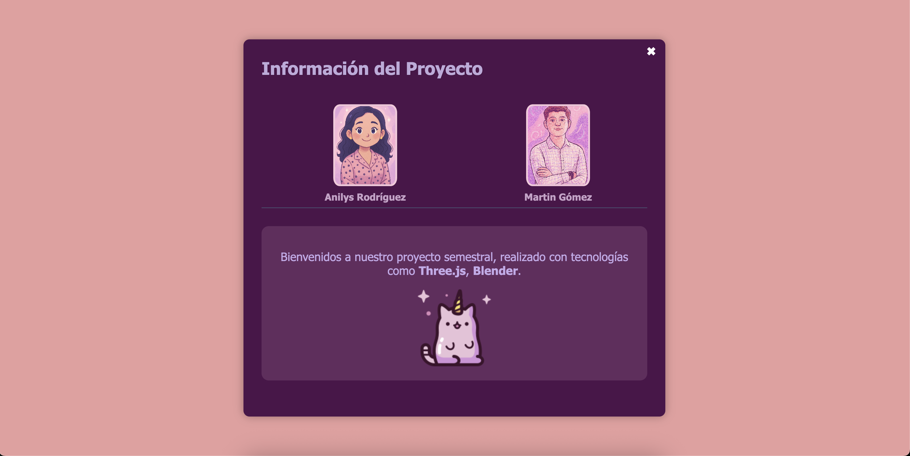

# Isometric Room Project 🛋️🎮

Experiencia 3D interactiva en navegador con **Three.js** inspirada en los cuartos "gamer/creativos" isométricos.

## 📸 Screenshots

<div align="center">


*Pantalla de bienvenida*


*Vista del cuarto isométrico*


*Panel de información*

</div>

## 📝 Descripción
Este proyecto muestra cómo llevar un modelo 3D (creado en Blender y exportado a `.glb`) a la web con rendimiento optimizado, sonido ambiente, shaders personalizados y controles de cámara, todo orquestado con Three.js. El usuario puede explorar el cuarto, hacer hover/clic en objetos y disfrutar de iluminación dinámica y audio envolvente.

## ✨ Características principales
- **Modelado detallado** exportado como GLB
- **Iluminación realista** con sombras suaves y control de exposición
- **Audio ambiental** mediante Web Audio API
- **Texturas WebP** para reducir peso sin perder calidad
- **Skybox & vídeo de fondo** para inmersión total
- **Interacciones con Raycaster** (hover, clic y tooltips)
- **Shaders GLSL** que añaden efectos animados (emisión, glow, etc.)

## 🛠️ Tecnologías
- **Three.js (v0.16x)**
- **Vite** para empaquetado y HMR
- **JavaScript ES2022+**
- **GLSL** (fragment y vertex shaders)
- **HTML y CSS** puros
- **Vercel** para despliegue continuo

> Distribución aproximada del código: 83% JS, 6% GLSL, 5% HTML, 5% CSS.

## 📁 Estructura de carpetas

```
.
├─ public/           # Skybox, audio, texturas, favicon, etc.
├─ src/
│  ├─ assets/        # Modelos GLB, imágenes, shaders crudos
│  ├─ core/          # Config de escena: cámara, luces, renderer
│  ├─ components/    # Clases para objetos interactivos
│  ├─ utils/         # Helpers (loader, resize, gui)
│  └─ main.js        # Punto de entrada; inicializa todo
├─ index.html        # Contenedor raíz del canvas
└─ vite.config.js    # Configuración de Vite
```

## 📋 Requisitos previos
- Node 18 o superior
- Navegador con WebGL 2.0
- 300 MB libres para dependencias y assets locales

## 🚀 Instalación y primer arranque

```bash
git clone https://github.com/martingom4/IsometricRoom_Project.git
cd IsometricRoom_Project
npm install          # instala dependencias
npm run dev          # arranca servidor con HMR en http://localhost:5173
```

## 🔧 Comandos útiles

| Comando | Descripción |
|---------|-------------|
| `npm run dev` | Desarrollo con recarga en caliente |
| `npm run build` | Compila y minimiza para producción |
| `npm run preview` | Sirve la build generada para revisión |

## 💡 Uso general

### 1. Carga/optimización de modelos
Coloca tus `.glb` en `src/assets/models` y usa el helper GLTFLoader desde `utils/loader.js`.

### 2. Añadir un objeto interactivo
- Importa la clase base `InteractiveObject` desde `components/`
- Herédala y sobrescribe `onHover()` / `onClick()`

### 3. Modificar shaders
- Edita los archivos en `src/assets/shaders/`
- Vite recargará el material al guardar

### 4. Cambiar audio ambiente
Sustituye el archivo en `public/audio/ambient.mp3` y actualiza el path en `core/sound.js`.

## ⚙️ Personalización rápida

- **Cambiar color de luces**: `core/lights.js` → ajusta color en `new THREE.PointLight`
- **Velocidad de rotación de cámara**: `utils/controls.js` → multiplica `controls.autoRotateSpeed`
- **FOV de cámara**: `core/camera.js` → modifica `fov` y llama `camera.updateProjectionMatrix()`
| `npm run build` | Compila y minimiza para producción |
| `npm run preview` | Sirve la build generada para revisión |

## 💡 Uso general

### 1. Carga/optimización de modelos
Coloca tus `.glb` en `src/assets/models` y usa el helper GLTFLoader desde `utils/loader.js`.

### 2. Añadir un objeto interactivo
- Importa la clase base `InteractiveObject` desde `components/`
- Herédala y sobrescribe `onHover()` / `onClick()`

### 3. Modificar shaders
- Edita los archivos en `src/assets/shaders/`
- Vite recargará el material al guardar

### 4. Cambiar audio ambiente
Sustituye el archivo en `public/audio/ambient.mp3` y actualiza el path en `core/sound.js`.


## ⚙️ Personalización rápida

- **Cambiar color de luces**: `core/lights.js` → ajusta color en `new THREE.PointLight`
- **Velocidad de rotación de cámara**: `utils/controls.js` → multiplica `controls.autoRotateSpeed`
- **FOV de cámara**: `core/camera.js` → modifica `fov` y llama `camera.updateProjectionMatrix()`


